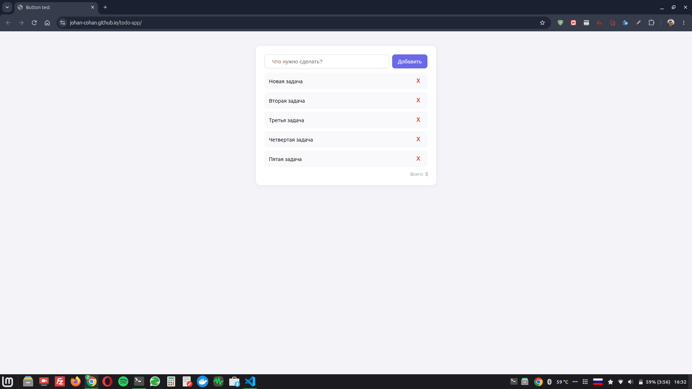

# Todo App



Простой и удобный список задач на чистом JavaScript.

🔗 **[Открыть демо](https://johan-cohan.github.io/todo-app/)** ← сюда ссылку из GitHub Pages

## Возможности

- ✅ Добавление задач (кнопка или Enter)
- ✅ Удаление задач одним кликом
- ✅ Сохранение в localStorage — данные не теряются при перезагрузке
- ✅ Счётчик задач
- ✅ Пустое состояние с подсказкой

## Технологии

- HTML5
- CSS3 (Flexbox, CSS-переменные)
- JavaScript (vanilla, без фреймворков)
- localStorage API

## Как запустить локально

1. Склонируй репозиторий:
   ```bash
   git clone https://github.com/Johan-cohan/todo-app.git